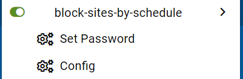
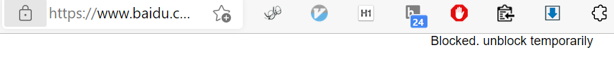

# block-sites-by-schedule
Block sites by schedule. Mainly for parents.

This is a greasemonkey userscript. It has following menu items:



The config format is 4 fields separated by one space, the 4 fields are:
- rule name
- regular expression of url
- start hour in each day where a site is blocked
- end hour in each day where a site is blocked.
```
scratch .*scratch.mit.edu.* 0700 2000
crazygames .*crazygames.com.* 0700 2200
mathsisfun .*mathsisfun.com.* 0700 2200
coolmathgames .*coolmathgames.com.* 0700 2200
addictinggames .*addictinggames.com.* 0700 2200
kcls .*read.overdrive.com.* 0700 2000
```

When blocked, the user script will show following message, click "unblock temporarily", the script will ask you about password and how many minutes to unblock.




